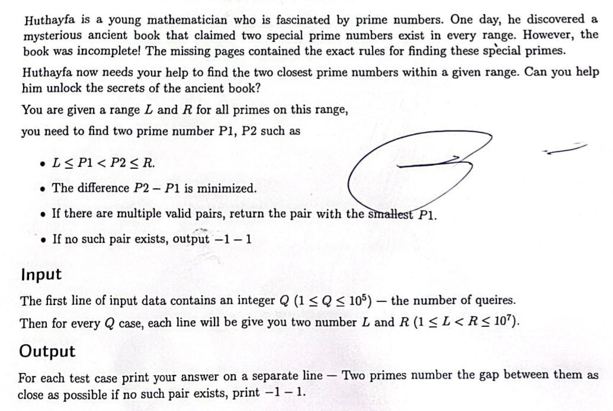

# Parallel and Distributed Computing - Project I

## Project Title
**Parallelizing a Sequential Algorithm Using Pthreads**

## Student
- **Name:** Ahmad Sabbah  

## Description
This project solves a problem that originally appeared in a competitive programming contest — finding the two closest prime numbers within a given range for multiple queries.

To enhance performance, I implemented both a sequential and a parallel version using Pthreads, and then compared their execution times to measure the speedup.

